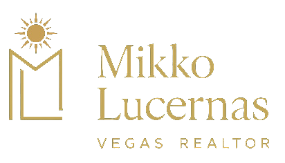

<p align="center">
  
</p>

<h1 align="center">Las Vegas Real Estate, Reimagined</h1>

<p align="center">
  A premium real estate experience built for buyers, sellers, military families,<br />
  and clients relocating to the Las Vegas Valley.
</p>

<p align="center">
  
  
  
  
  
</p>

---

<table>
  <tr>
    <td width="58%" valign="middle">
      <h2>A digital home for a modern REALTOR®</h2>
      <p>
        This website pairs editorial storytelling with practical property-search
        tools. The experience is designed to establish trust quickly, guide visitors
        toward the right service, and turn interest into qualified conversations.
      </p>
      <p>
        <strong>Brand direction:</strong> refined navy, warm gold, natural neutrals,
        confident typography, cinematic media, and restrained motion.
      </p>
      <p>
        <strong>Specialties:</strong> new construction, relocation, VA and military
        buyers, residential sales, and Las Vegas communities.
      </p>
    </td>
    <td width="42%" align="center">
      
    </td>
  </tr>
</table>

## The experience

| Capability | What it delivers |
|---|---|
| Cinematic introduction | Video-led hero, clear positioning, and an immediate property-search entry point |
| Property discovery | Filterable listings, map-based browsing, responsive cards, and focused listing previews |
| Local expertise | Dedicated community, relocation, cost-of-living, and new-construction content |
| Buyer resources | Mortgage and VA loan calculators plus downloadable homebuyer guides |
| Seller conversion | Home-valuation flow, sold-property proof, strong calls to action, and lead capture |
| Trust and authority | Agent story, real client reviews, credentials, social proof, and recent results |
| Thoughtful interaction | Accessible controls, purposeful motion, mobile layouts, loading states, and reduced-motion support |

## Featured pages

| Journey | Routes |
|---|---|
| Home search | `/`, `/buy`, `/communities/[slug]` |
| Seller services | `/home-valuation`, `/sold` |
| Relocation | `/california-vs-las-vegas`, `/cost-of-living` |
| New construction | `/new-construction` |
| Resources | `/guides`, `/guides/[slug]`, `/blog`, `/blog/[slug]` |
| Calculators | `/resources/mortgage-calculator`, `/resources/va-loan-calculator` |

## Technology

- **Framework:** Next.js 15 with the App Router and React 18
- **Language:** TypeScript
- **Styling:** Tailwind CSS with a custom navy, gold, and sage design system
- **Motion:** Framer Motion
- **Maps:** MapLibre GL with Protomaps basemap styling
- **Icons:** Phosphor Icons
- **Lead handling:** Server-side validation, rate limiting, and webhook forwarding

## Getting started

### 1. Install and configure

```bash
npm install
cp .env.example .env.local
```

Add the required values to `.env.local`:

| Variable | Purpose |
|---|---|
| `NEXT_PUBLIC_MAP_KEY` | Browser-safe map provider key; restrict it to approved origins |
| `LEAD_WEBHOOK_URL` | Private server-side CRM or automation webhook for lead delivery |

Never prefix the lead webhook with `NEXT_PUBLIC_`; it must remain server-only.

### 2. Run locally

```bash
npm run dev
```

Open [http://localhost:3000](http://localhost:3000).

### 3. Verify production readiness

```bash
npm run lint
npm run build
npm start
```

The first production build requires internet access because the project loads its
web fonts during the build.

## Project structure

```text
src/
├── app/                 Routes, metadata, loading/error states, and lead API
├── components/          Navigation, hero, search, maps, reviews, forms, and media
└── lib/                 Listings, sold homes, guides, blog content, and lead helpers

public/
├── guides/              Downloadable buyer resources
├── icons/               Social media assets
├── profile/             Professional agent photography
├── sold/                Recent-sale imagery and proof
└── videos/              Hero and section background films
```

Core listing, review, community, and agent content lives in
[`src/lib/data.ts`](./src/lib/data.ts). Blog posts, guides, and sold-home records are
kept in their respective modules inside `src/lib/`.

## Production integrations

The interface and lead endpoint are in place; these external services should be
connected and reviewed before a public launch:

- Replace demonstration listing data and photography with an authorized MLS/IDX feed.
- Configure `LEAD_WEBHOOK_URL` for the production CRM or automation platform.
- Restrict the public map key by origin and enable provider-side usage limits.
- Connect approved Google Business Profile review data where live synchronization is required.
- Verify brokerage, fair-housing, privacy, and local real-estate disclosures.

## Brand assets

The repository includes the official Mikko Lucernas logo, professional portrait,
social icons, closing graphics, video backgrounds, and client-facing PDF guides.
These assets should retain their original proportions and should not be recolored
outside the established navy, gold, cream, and sage palette.

---

<p align="center">
  <strong>Mikko Lucernas</strong><br />
  Las Vegas REALTOR® · New Construction & Relocation Specialist
</p>
